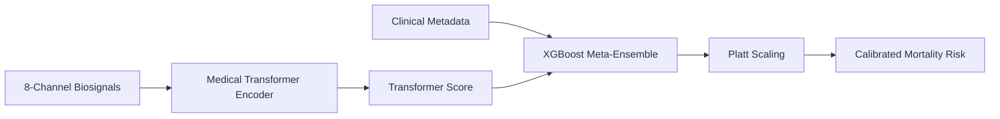
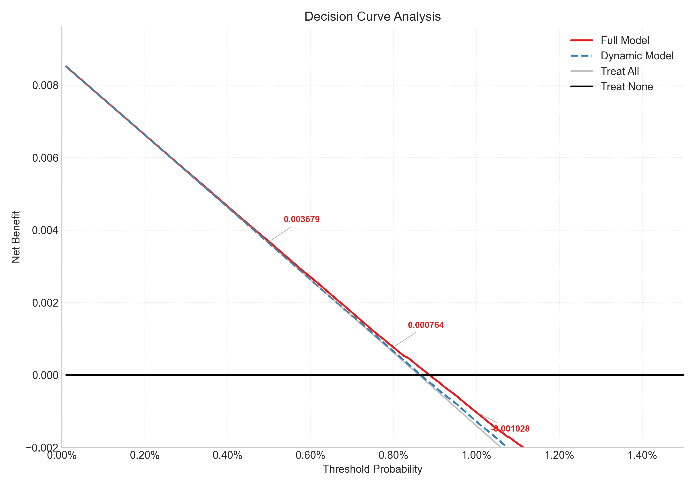
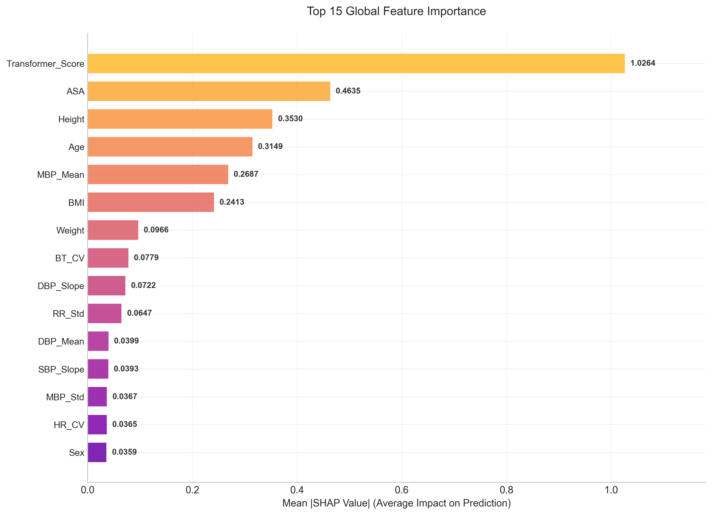

<div align="center">

# Deep Meta-Ensemble for Intraoperative Mortality Prediction


**Real-time Intraoperative Mortality Prediction & Clinical Blind Spot Detection System**<br>
*A Hybrid Transformer-XGBoost Pipeline for Extremely Imbalanced Biosignal Data*

</div>

## 📑 Abstract
Intraoperative mortality is a highly critical but extremely rare clinical event (prevalence ~ 0.89%). This project implements an end-to-end deep learning pipeline that predicts surgical mortality by extracting temporal patterns from high-resolution physiological waveforms. 

**Key Achievement** : The final model achieved a test AUPRC of **0.0552**, representing a **6.2x improvement** over the baseline prevalence (0.0089). This significantly reduces clinical uncertainty in high-risk monitoring scenarios.

---

## 💾 Dataset & Medical Preprocessing
* **Source** : [SNUH VitalDB Open Dataset](https://khdp.net/database/data-search-detail/658/vitaldb_open/1.0.0)
* **Cohort** : 6,388 surgical cases (Mortality : 57 cases | Survival : 6,331 cases).
* **Refinement** : Applied physiological clamping (HR : 20-250, MBP : 20-300) and linear interpolation to remove motion artifacts while maintaining underlying physiological trends.

---

## 🧠 Core Architecture & Technical Justification

### 1. Architectural Flow
The pipeline consists of a **Medical Transformer Encoder** for feature extraction and an **XGBoost Meta-Ensemble** for final classification.



### 2. Why This Technology? (Technical Justification)
* **Medical Transformer** : Selected to capture **long-range temporal dependencies** and subtle interaction patterns across 8 concurrent signals that traditional RNNs often miss.
* **Custom Focal Loss (γ = 4.0)** : Specifically implemented to prioritize "hard examples" (rare fatal cases), preventing the model from being overwhelmed by the 99.11% survival majority.
* **Platt Scaling** : In clinical settings, raw probabilities can be misleading. We applied **Logistic Calibration** to ensure predicted risks map accurately to real-world outcomes (**Brier Score : 0.0593**).

---

## 📊 Clinical Validation & Results

### 1. Quantitative Performance & Ablation Study
The hybrid model significantly outperformed the dynamic-only baseline, proving the necessity of fusing temporal features with static metadata.

| Metric | Full Hybrid Model | Dynamic Only (Ablation) |
| :--- | :--- | :--- |
| **5-Fold CV AUROC** | **0.9922 (± 0.0026)** | - |
| **5-Fold CV AUPRC** | **0.9873 (± 0.0037)** | - |
| **Test AUPRC** | **0.0552** | 0.0328 (Drop : 0.0224) |

### 2. Clinical Utility & Robustness
<table align="center" style="border: none; border-collapse: collapse;">
  <tr>
    <td align="center" width="50%" style="border: none;"><b>Decision Curve Analysis (DCA)</b></td>
    <td align="center" width="50%" style="border: none;"><b>Global Feature Impact (SHAP)</b></td>
  </tr>
  <tr>
    <td style="border: none;"></td>
    <td style="border: none;"></td>
  </tr>
</table>

* **Noise Robustness** : Maintained stable performance even under **50% Gaussian noise** injection.
* **Data Drift Test** : Resilience against **20% systematic sensor drift**, simulating device aging in real-world OR environments.

---

## ⚡ System Performance & Latency
Optimized with PyTorch Mixed Precision (`autocast`) for high-throughput OR environments :
* **Average Inference Latency** : `1.3309 ms` per case.
* **System Throughput** : `751.39 FPS`.
* **Verdict** : Fully suitable for real-time edge deployment in surgical monitoring systems.

---

## 📅 Project Scope & Contribution
* **Contribution Breakdown (100% Individual Project)** :
    * **Data Engineering (30%)** : Scalable preprocessing of 98GB raw data, missing value imputation, and physiological feature windowing.
    * **Hybrid Modeling (40%)** : Implementation of Medical Transformer, custom Focal Loss function, and XGBoost Meta-Ensemble.
    * **Clinical Validation (30%)** : Executing DCA, SHAP-based XAI, and Robustness stress tests.

---

## 🚀 Installation & Usage
### 1. Prerequisites
```bash
git clone [https://github.com/heuiseung/vitaldb-mortality-prediction.git]
cd vitaldb-mortality-prediction
pip install -r requirements.txt
```

### 2. Run the Pipeline
```bash
jupyter notebook intraoperative_mortality_prediction.ipynb
```